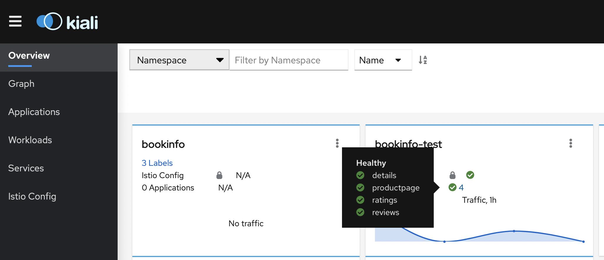
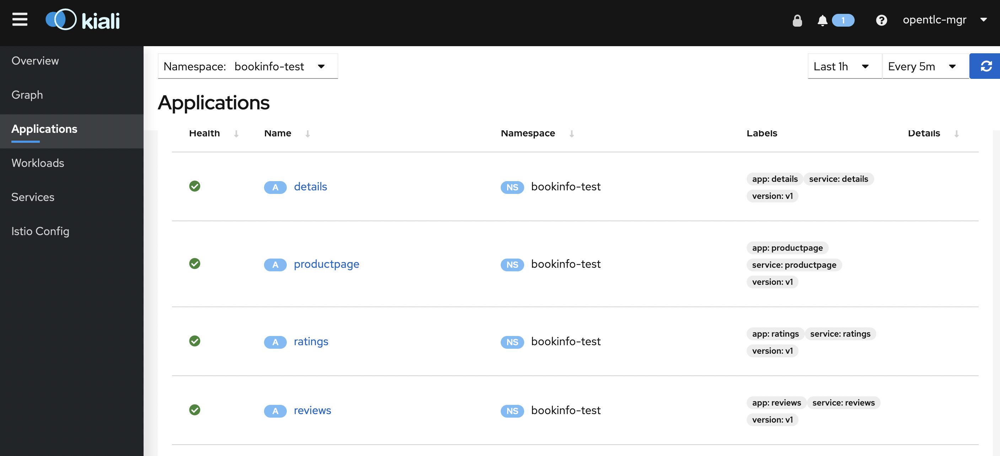
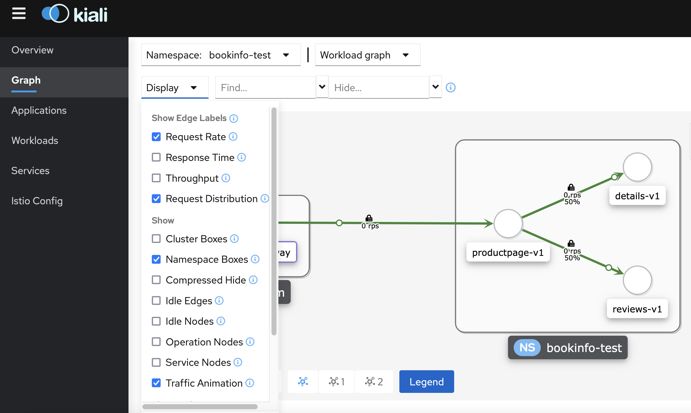
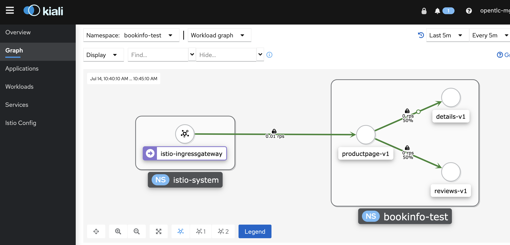
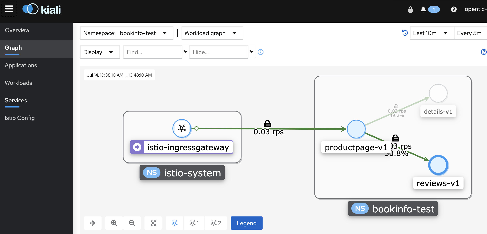
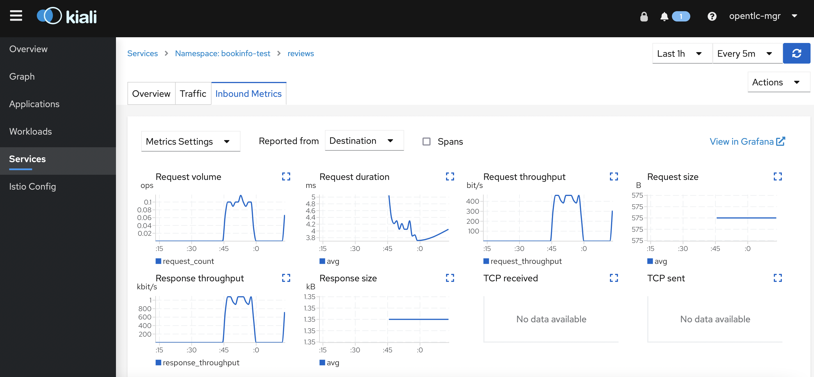
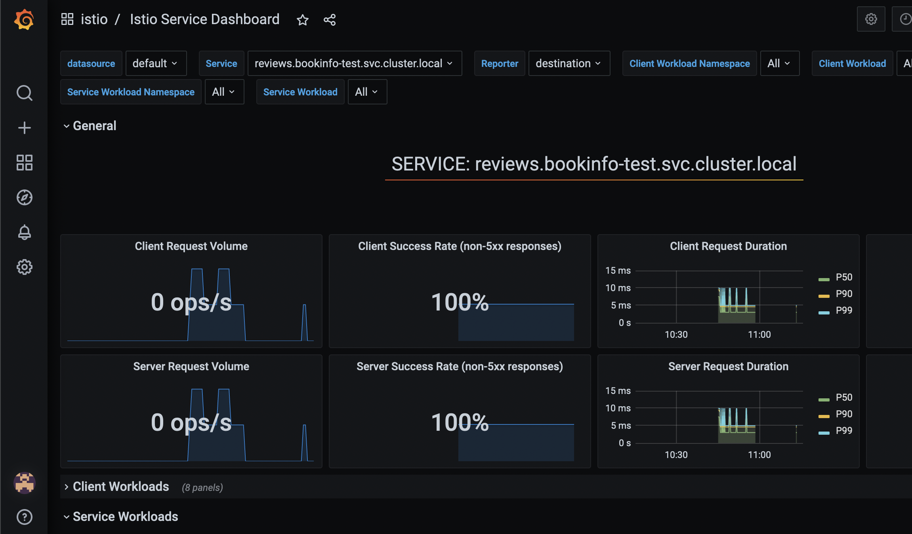

# Example GitOps-managed Service Mesh

Use this repository as a starting point to manage a Service Mesh on an OpenShift cluster.

## Provisioning the Service Mesh

1. Go to `Use this template > create a new repository` to generate a copy of this repository that you will use to manage your OpenShift cluster.

   The next instructions will ask you to make changes to your `cluster-gitops` repository. You can do this simply by editing directly in GitHub by just pressing `.` on your keyboard to open in a browser-based editor. Or you can clone your repo to your local machine and make changes locally.

2. Configure the example ArgoCD `Application` by providing your new repository URL `spec.source.repoURL` in the following files:

    ```
    apps/application-argo-rollouts.yaml
    apps/application-service-mesh-operators.yaml
    apps/application-service-mesh-qa.yaml
    apps/application-service-mesh-test.yaml
    bootstrap/instance/application.yaml
    ```

3. Provision the ArgoCD operator:

    ```
    oc apply -k bootstrap/operator
    ```

4. Provision the ArgoCD `Application`:

    ```
    oc apply -k bootstrap/instance
    ```

## Observing ArgoCD Progress

1. The demo bootstrap initiates a default ArgoCD instance hosted in the `openshift-gitops` namespace. In this namespace a `Route` is deployed which provides a URL to the ArgoCD console.

## Onboarding an Application to the Service Mesh

The following instructions will describe how to manage applications deployed to the Service Mesh with this GitOps framework.

1. Make a fork of this [sample application repo](https://github.com/RHC-STP-OSSM/gitops-app-bookinfo) you will use the fork's URL later in the instructions.

2. Switch back to editing your `cluster-gitops` repo.

3. Request new namespaces for a `test` and `qa` instance of the sample application

   For the `test` instance, edit `servicemesh/instance/overlays/test/namespaces.yaml` and uncomment all lines

   For the `qa` instance, edit `servicemesh/instance/overlays/qa/namespaces.yaml` and uncomment all lines

4. Add the new namespaces to the ServiceMeshMemberRoll

   For the `test` instance, edit `servicemesh/instance/overlays/test/servicemeshmemberroll.yaml` and uncomment all lines

   For the `qa` instance, edit `servicemesh/instance/overlays/qa/servicemeshmemberroll.yaml` and uncomment all lines

5. Configure ArgoCD Applications for the bookinfo example

   In the file `apps/application-bookinfo-test.yaml` application replace `spec.source.repoURL` with the URL to your application source fork created in step #1.

   Also, in the file `apps/application-bookinfo-qa.yaml` application replace `spec.source.repoURL` with the URL to your application source fork created in step #1.

6. Uncomment the lines in `apps/kustomization.yaml` to deploy those apps to include the `test` and `qa` applications you configured in the previous step.

7. Publish your changes to your fork in your favorite way. If you're editing locally, for example, you can commit and push like this:

   ```
   git add .
   git commit -m "onboard the bookinfo app"
   git push origin main
   ```

## Validating the bookinfo example in the test environment

1. Use Kiali to visualize bookinfo traffic:

   ```
   KIALI_URL=$(oc get route kiali -n istio-system-test -o jsonpath='{.spec.host}')
   ```
   Or using openshift console: Networking->Routes->kiali

   Open the URL on a browser and then click on the `bookinfo-test` app:

   

2. Make sure all services are healthy:
   

3. Call the `productinfo` page: export the ingress gateway URL into an env variable, use curl to invoke it:
   ```
   BOOK_GW=$(oc get route istio-ingressgateway -n istio-system-test -o jsonpath="{.spec.host}{.spec.path}")
   ```
   ```
   curl -v $BOOK_GW/productpage | grep '<title>Simple Bookstore App</title>'
   ```

4. Setup Kiali for traffic visualization by going to the left menu `Graph` then click on the drop down `Display` and select `Request Rate`, `Request Distribution`, `Namespace Boxes`, `Traffic Animation` options:
   

5. Use a simple script below to call the `productpage` every 10s:
   ```
   while true; \
   do curl -v $BOOK_GW/productpage | grep '<title>Simple Bookstore App</title>'; \
   sleep 10;done
   ```
   Enter Control-C to stop the script.

6. Switch to the graph and watch the animation, observe the statistics chosen in the graph selection:
   

7. Select the reviews service by clicking on the node and observe on the right the incoming traffic:
   

8. If you want to inspect traffic metrics even further, go to the left menu named `Services` and select the `reviews` service, then click on the `Inbound Metrics` tab:
   

9. In the same Kiali service view you have the ability to see more in detail metrics by jumping to Grafana, click on the blue link that reads `View in Grafana` and expect something like this:
   


## Perform an application update and trigger a rollout

1. The next instructions will ask you to make changes to your `gitops-app-bookinfo` repository fork. You can do this simply by editing directly in GitHub by just pressing `.` on your keyboard to open in a browser-based editor. Or you can clone your fork to your local machine and make changes locally.

2. Edit the image version for the `productpage` deployment.

   In the file `envs/test/version-productpage-v1.yaml` update the image version `:2.1.0` -> `:2.2.0`

   Note: You can imagine that this change might be performed by pipeline automation

3. Publish your changes to your fork in your favorite way. If you're editing locally, for example, you can commit and push like this:

   ```
   git add .
   git commit -m "bump productpage version"
   git push origin main
   ```

   Note: In a fully operational GitOps environment, you might have a post-commit hook on the `gitops-app-bookinfo` repository to notify ArgoCD to refresh automatically. In a demo scenario, you may just want to manually trigger a refresh of the `bookinfo` application in the ArgoCD UI. This will cause ArgoCD to notice the change and begin the rollout.

4. Observe the rollout which increases traffic to the new application instance 20% at a time, with a 10 second pause between each step. There are many ways to observe rollouts:

   - observe the progress of the rollouts controller pod in the `argo-rollouts` namespace
   - use the Argo Rollouts `kubectl` [plugin](https://argoproj.github.io/argo-rollouts/installation/#kubectl-plugin-installation)
   - view the rollout progressing in the ArgoCD UI
   - use Kiali and techniques described in the validation section above, especially while running the curl loop! 
